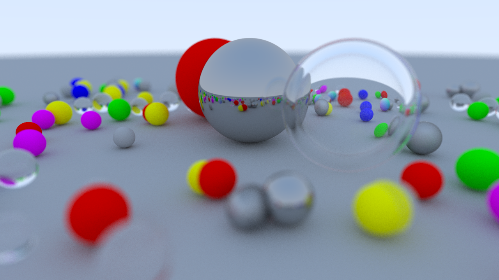

# ZeRay Tracer



This is a work-in-progress CPU based ray tracer inspired by [Ray Tracing In One Weekend](https://raytracing.github.io/books/RayTracingInOneWeekend.html).
The program is not 1:1. [Alterations seen here](#alterations).

## Building
If you would like to generate a VS or other platform project, it is a good idea to run CMake in a seperate directory for an out of source build
```
cmake -B <path-to-build> [-S <path-to-source>]
```
Alternatively,
```
cd path/to/build/directory
cmake path/to/source/directory
```
For building the executable/application,
```
cmake --build <dir> [<options>]
```
For options: [CMake's own synopsis](https://cmake.org/cmake/help/latest/manual/cmake.1.html)

With Visual Studio 2022 I was able to create a new CMake project instead of the solution. This automatically runs the target include/links on save and build.
This also comes with `CMakePresetsSettings.json` which I did not include as it relates to my own environment and may not relate yours.

I wanted a better way to select chapters via a simple build/link argument in the command line but I am still a newbie. 
Everything was pointing towards a configuration step, which from my understanding makes it so you would have to regenerate the build system.

### Chapter Specific 
For chapter specific builds I opted for a define/preprocessor symbol seen in `src/chapters/ChapterInterface.h`
Simply just replace the define with
```
#define CHAPTER_X
```
where `X` has a corresponding `src/chapters/ChapterX.cpp` file.

## Running
Wherever you built the application, simply just call:
```
RayTracer.exe
```
Though, with how renders get exported currently (in PPM format), you need to pipe the output to a file. So something like this should do the trick:
```
RayTracing.exe > image.ppm
```
I intend to use a PNG format in the near future instead to mitigate this.

## Alterations

There were various things that I did differently than the textbook or most people.
Before you take a look, just know that I will not argue these alterations are the best. 
I am beginner and a learner. I find that making decisions like these allows me to learn why you do
something and why you do not.

### Functional
- **Composition Over OOP**: Instead of making materials inherit eachother, I just defined one and optionally set values. I also opted out of using the "Hittable" abstract class due to the VTable lookups necesary, and instead just used template programming.
- **Multithreading**: With the CPU doing the rendering it can get painfully slow with samples and bounces. I used the standard library threading, split the texture into x sections (either predefined or your hardware concurrency limit) and write each pixel to a buffer which is then read into the texture file (via piping).
- **Absence Front Facing Normal Boolean**: I did not get this. Felt like an unnecessary byte to add when you can just calculate the dot product to determine which side of the face the ray intersects with.
- **Move Semantics**: I prefer the simple primitives of C for memory management, but when in Rome... Tried to take advantage of moves whenever since there is a decent portion of code that utilizes rvalues.
- **Randomized Balls**: I used the `random_in_unit_disk` function to generate the randomized ball placements instead of the nested loop structure in the textbook. I thought it was convienient!
<!--- - **PNG**: PPM was fun while it lasted, but eventually I opted to use a PNG library. -->
<!--- - **Bounding Volume Hierarchy (BVH)**: Instead of just looping through a list, I created a BVM datastructure which reduces the search time to O(N*log N)-->
<!--- - **ImGUI Window**: Wanted a way to visualize the render other than just opening the image. -->
### Aesthetic
- **Not Header Only**: I use CPP files to separate the implementation from the definition.
- **Specified Headers**: The textbook uses a header to easily include lots of references. I did not. I like to know specifically what is included.
- **Units**: A centimeter is the best smallest unit to use in a 3D graphical application, and I will stand by this (just based on vibes).
- **Coordinate System**: I use Unreal Engine coordinates forward, right, and up (FRU = XYZ). This is done instead of the right handed coordinate system the textbook uses, which 
I know is technically a bad idea considering most graphics APIs use that system. It was simply a way to make the implementation more challenging I suppose. *(Technically in UE6 they will be using LUF).*
- **Chapters 1-7 & 14 Being Separate Buildable Sources**: Chapters 1-7 & 14 are split into the `src/chapters` directory, with the `src/Main.cpp` being the entry point and `src/chapters/ChapterInterface.h` being the "rerouter."
Each chapter is a `ChapterX.cpp` file.
The purpose of laying out the project this way is so progress is not lost or overwritten. This, I think, is beneficial
because I leave an abundance of comments demonstrating my thought process and challenges.
Not only is the code for each chapter visible, it is also possible to build them seperately (see [Building](#building) section). 
Utility classes like `vec3` and the like are visible from the `src/core` directory. Their use is conditional to the chapter. 
	- **Why no chapters 8-13?:** because at that point most of the functionality is within encapsulated objects or at the very least separate files. Would be too many files IMO.
- **Vector Negative Unary & [] Operators**: There was no negative unary nor [] operator overload so I decided to add them for convenience. *Their presence is assumed in Listing 19 and 86 respectively?*
- **Bonus "Normals" Material**: The normal/gradient coloring that is used earlier in the textbook is included as a material type for fun. Think of it as a bonus shader!
- **I Didn't Do It In "One Weekend"**: I am a fulltime student who also works. Sorry!